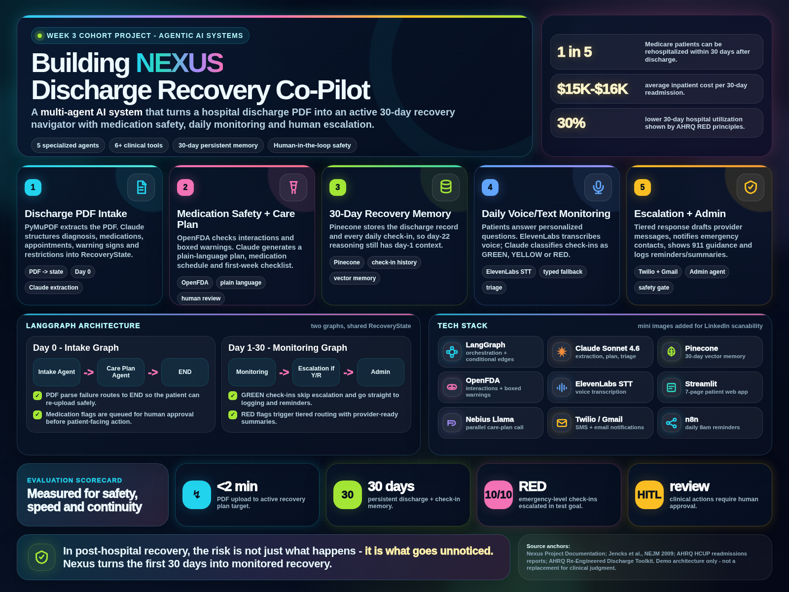
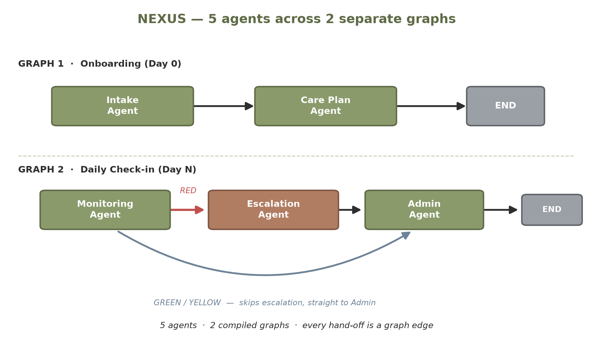

# Nexus
### A multi-agent post-hospital recovery co-pilot

[](https://github.com/raghavanlakshmi/nexus/actions/workflows/tests.yml)


Nexus turns a hospital discharge summary into a 30-day recovery companion. It tracks medications,
runs daily symptom check-ins, schedules follow-ups, and escalates to a human before anything goes wrong.



> Built with synthetic discharge data only. Not medical advice — in an emergency, call 911.

---

## Architecture

Five specialised agents coordinated by two LangGraph state machines:

| Agent | Responsibility |
|---|---|
| **Intake** | Parses the discharge PDF (PyMuPDF) and extracts structured clinical data with Claude |
| **Care Plan** | Checks medication interactions against OpenFDA and writes a plain-language recovery plan |
| **Monitoring** | Daily check-in loop that classifies each day GREEN / YELLOW / RED |
| **Escalation** | Tiered response for RED days: draft for provider (Tier 1), notify emergency contact (Tier 2), show 911 screen (Tier 3) |
| **Admin** | Appointment reminders, family updates, weekly summaries |



Intake stops early if the PDF can't be parsed.

**Human in the loop:** clinical content — provider messages and medication-conflict alerts — waits in
an approval queue until a person approves it. Sent automatically: appointment reminders and weekly
summaries to the caregiver, and an SMS to the emergency contact on a Tier 2/3 escalation, only if the
patient consented.

**Instrumentation:** every Claude call goes through `instrumentation/usage_tracker.py`, which logs
tokens, cost and latency per phase; the *System Usage (Debug)* page shows the totals. The OpenFDA
and PDF tools are also traced to LangSmith when tracing is enabled.

## Tech stack

LangGraph · Claude (`claude-sonnet-4-6`) · Nebius Token Factory (`Llama-3.3-70B-Instruct`) · Pinecone ·
Streamlit · PyMuPDF · OpenFDA · ElevenLabs speech-to-text · Twilio · n8n (daily check-in trigger)

## UI

Seven Streamlit screens: onboarding (PDF upload) · care plan · daily check-in (voice or typed) ·
approval queue · recovery dashboard · provider summary · hospital history — plus a usage/debug page.

---

## Running it locally

```bash
git clone https://github.com/raghavanlakshmi/nexus.git
cd nexus
python -m venv venv
source venv/bin/activate        # Windows: venv\Scripts\activate
pip install -r requirements.txt
cp .env.example .env            # then fill in your keys
```

`ANTHROPIC_API_KEY` and the Pinecone settings are required. Nebius, ElevenLabs, Twilio and Google
Calendar are optional integrations.

Create a Pinecone index named to match `PINECONE_INDEX_NAME`, with **1024 dimensions** and the
**cosine** metric. Then:

```bash
streamlit run ui/streamlit_app.py
```

Voice check-in needs `ffmpeg` on your PATH (`packages.txt` installs it on Streamlit Cloud).
`n8n/daily_checkin_workflow.json` is an importable n8n workflow for scheduled daily check-ins.

### Demo data

`data/` contains ten synthetic discharge summaries covering different conditions and levels of
detail. Start with `01_chf_john_demo.pdf`. The `*_sparse.pdf` files deliberately omit information
to test how the agents handle missing data.

### Tests

```bash
pip install -r requirements-dev.txt
python -m pytest -q tests        # offline, no API keys needed
```

The tests cover graph routing (RED → escalation, GREEN/YELLOW → admin, unparseable PDF stops early)
and the escalation tiers — including a test that documents the paraphrase limitation below.

---

## Known limitations

- **Placeholder embeddings.** `tools/pinecone_store.py` uses a hash-based stand-in vector rather than
  a real embedding model, so Pinecone acts as a per-patient store, not semantic search.
- **Keyword-based escalation tiers.** `determine_escalation_tier()` matches literal phrases, so a
  paraphrased emergency ("feels like an elephant on my chest") can be under-tiered. This was measured
  and fixed in [Hub v2](https://github.com/raghavanlakshmi/hub).
- Per-session state only — no authentication or multi-user persistence.

## Related

- **[Hub](https://github.com/raghavanlakshmi/hub)** — the same system collapsed to two agents, built
  to measure what the five-agent split actually costs.

## License

[MIT](LICENSE)
